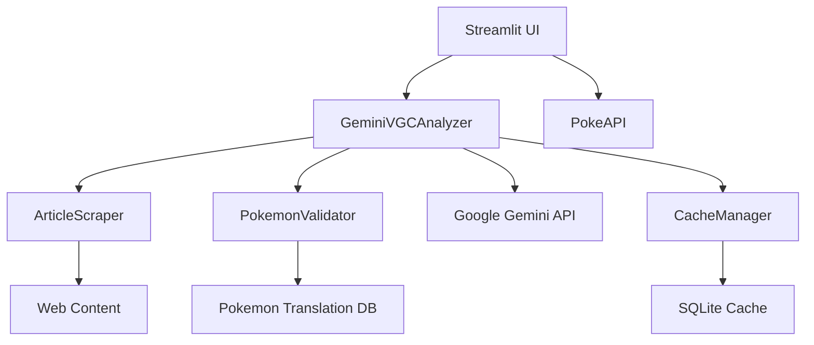

# System Architecture

## Overview

The Pokemon VGC Analysis Platform follows a clean, modular architecture designed for maintainability, testability, and extensibility. Built with Python and modern web technologies, the system processes Japanese VGC content through multiple specialized components.

## Architecture Principles

### 1. Separation of Concerns
- **Core Logic**: Business logic separated from UI and utilities
- **UI Layer**: Clean separation between presentation and data
- **Data Layer**: Isolated database and caching concerns
- **External Services**: API integrations abstracted through interfaces

### 2. Dependency Injection
- Configuration injected through dedicated Config class
- Services instantiated with clear dependencies
- Testable components with mockable interfaces

### 3. Error Handling Strategy
- Graceful degradation with multiple fallback strategies
- Contextual error messages with user guidance
- Comprehensive validation with confidence scoring

## System Components



## Core Components

### 1. Analysis Engine (`src/core/analyzer.py`)

**Responsibilities:**
- Orchestrates the entire analysis workflow
- Manages Gemini API interactions
- Coordinates validation and caching
- Provides confidence scoring and user guidance

**Key Design Patterns:**
- **Strategy Pattern**: Multiple generation strategies for fallbacks
- **Template Method**: Consistent analysis workflow with customization points
- **Facade Pattern**: Simplified interface hiding complex subsystem interactions

**Performance Optimizations:**
- Content preprocessing prioritizes VGC-relevant text
- Multiple fallback strategies reduce failure rates
- Intelligent prompt engineering minimizes API costs

### 2. Web Scraping Engine (`src/core/scraper.py`)

**Multi-Strategy Architecture:**
```python
strategies = [
    _scrape_with_standard_headers,    # Standard browser simulation
    _scrape_with_mobile_headers,      # Mobile user agent
    _scrape_with_japanese_headers,    # Japan-specific optimization
    _scrape_with_session_retry        # Session-based with delays
]
```

**Content Processing Pipeline:**
1. **Extraction**: Multi-selector content identification
2. **Filtering**: UI element removal and boilerplate cleaning
3. **Scoring**: VGC relevance assessment
4. **Truncation**: Smart content length management

**Robustness Features:**
- Encoding detection and UTF-8 normalization
- Dynamic content handling with delays
- Comprehensive error recovery

### 3. Pokemon Validation System (`src/core/pokemon_validator.py`)

**Validation Pipeline:**
1. **Name Translation**: Japanese → English with form awareness
2. **Form Correction**: Regional form standardization
3. **Paradox Validation**: Removal of invalid form suffixes
4. **EV Validation**: Range and efficiency checking

**Translation Database Design:**
```python
{
    'サーフゴー': 'Gholdengo',                    # Direct mapping
    'オーガポン (いどのめん)': 'Ogerpon-Wellspring',  # Form-specific
    'トルネロス': 'Tornadus-Incarnate'             # Default form
}
```

### 4. Caching System (`src/utils/cache_manager.py`)

**Cache Strategy:**
- **Content-based hashing**: Prevents duplicate analyses
- **TTL expiration**: Ensures fresh results for evolving meta
- **URL context**: Provides source traceability

**Cache Key Generation:**
```python
cache_key = hashlib.md5(
    f"{content_hash}_{url_hash}_{config_version}".encode()
).hexdigest()
```

## Data Flow Architecture

### 1. Analysis Request Flow

```
User Input → Content Validation → Cache Check → Scraping (if URL) → 
Content Preprocessing → AI Analysis → Pokemon Validation → 
Result Enhancement → Cache Storage → Response
```

### 2. Error Handling Flow

```
Exception → Error Classification → Context Generation → 
Fallback Strategy → User Guidance → Response
```

### 3. Confidence Scoring Flow

```
Raw Result → Team Quality Assessment → Content Indicators → 
Parsing Success → Confidence Calculation → User Guidance (if low)
```

## UI Architecture

### Streamlit Multi-Page Application

**Page Structure:**
- **Analysis Home**: Primary article analysis interface
- **Switch Translation**: Nintendo Switch screenshot analysis
- **Results Display**: Interactive team visualization

**Component Hierarchy:**
```
StreamlitApp
├── AnalysisHomePage
│   ├── InputSelector (URL/Text)
│   ├── ProcessingIndicator
│   └── ResultsDisplay
├── SwitchTranslationPage
│   ├── ImageUpload
│   ├── AnalysisOptions
│   └── TeamPreview
└── SharedComponents
    ├── PokemonCard
    ├── EVDisplay
    └── ExportButtons
```

## Database Architecture

### SQLAlchemy Models

**Team Storage:**
```python
class TeamAnalysis(Base):
    id = Column(Integer, primary_key=True)
    content_hash = Column(String, unique=True)
    analysis_data = Column(JSON)
    confidence_score = Column(Float)
    created_at = Column(DateTime)
    source_url = Column(String, nullable=True)
```

**Cache Storage:**
```python
class AnalysisCache(Base):
    cache_key = Column(String, primary_key=True)
    result_data = Column(JSON)
    expiry_time = Column(DateTime)
    access_count = Column(Integer, default=0)
```

## Configuration Management

### Layered Configuration System

1. **Environment Variables**: Production secrets and overrides
2. **Streamlit Secrets**: Development and API keys
3. **Default Values**: Fallback configuration
4. **Runtime Config**: Dynamic settings based on environment

**Configuration Hierarchy:**
```python
config_value = (
    os.getenv('CONFIG_KEY') or 
    st.secrets.get('config_key') or 
    DEFAULT_VALUES.get('config_key')
)
```

## Security Considerations

### API Key Management
- Environment variable priority
- Streamlit secrets for development
- No hardcoded credentials
- Secure key rotation support

### Input Validation
- URL validation before processing
- Content length limits
- XSS prevention through proper escaping
- Rate limiting for API protection

### Data Privacy
- No personal data storage
- Content hashing for privacy
- Optional URL anonymization
- Cache expiration for data cleanup

## Performance Architecture

### Optimization Strategies

**Content Processing:**
- Smart truncation preserving important information
- VGC-aware content prioritization
- Parallel processing where applicable
- Efficient memory usage patterns

**API Management:**
- Request batching for bulk operations
- Intelligent fallback strategies
- Cache-first approach
- Connection pooling for external APIs

**Caching Strategy:**
- Multi-level caching (memory + persistent)
- Intelligent cache invalidation
- Compression for large results
- Background cache warming

## Deployment Architecture

### Production Considerations

**Scalability:**
- Stateless design for horizontal scaling
- Database connection pooling
- External cache layer support (Redis)
- Load balancer compatibility

**Monitoring:**
- API usage tracking
- Performance metrics collection
- Error rate monitoring
- Cache hit rate analysis

**Reliability:**
- Circuit breaker pattern for external APIs
- Graceful degradation strategies
- Health check endpoints
- Automated failover support

## Testing Architecture

### Test Strategy

**Unit Tests:**
- Component isolation with mocking
- Business logic validation
- Error condition testing
- Performance boundary testing

**Integration Tests:**
- End-to-end workflow validation
- API integration testing
- Database interaction testing
- Real-world content validation

**Performance Tests:**
- Load testing with realistic content
- Memory usage profiling
- API rate limit testing
- Cache performance validation

## Future Architecture Considerations

### Extensibility Points

**New Pokemon Generations:**
- Translation database updates
- Form validation extensions
- Prompt engineering enhancements
- Visual recognition updates

**Additional Languages:**
- Internationalization framework
- Locale-specific processing
- Multi-language translation support
- Regional meta variations

**Enhanced AI Capabilities:**
- Multi-modal analysis expansion
- Real-time strategy suggestions
- Meta trend analysis
- Predictive team building

### Microservices Migration Path

**Service Boundaries:**
- Analysis Service (Core AI processing)
- Scraping Service (Content extraction)
- Validation Service (Pokemon data)
- Cache Service (Results management)

**Communication Patterns:**
- REST APIs for synchronous communication
- Message queues for async processing
- Event sourcing for audit trails
- Service mesh for observability